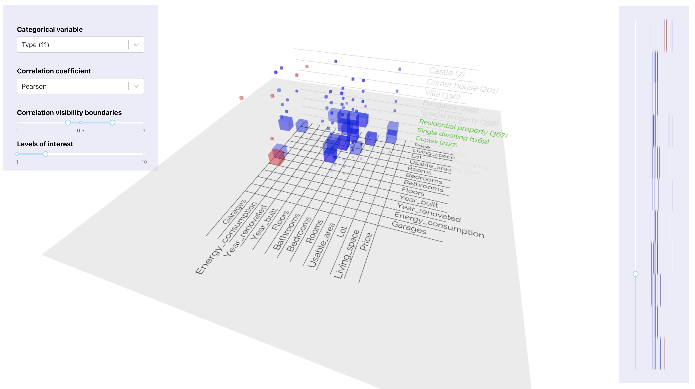

# PV251 Visualization - Grouping correlation matrix

This is the final project for the PV251 course at [FI MU]([https://link](https://www.fi.muni.cz/index.html.en)). In general, it is a set of vertically stacked correlation matrices onto each other, where each such a matrix displays correlations within particular group (value of some qualitative variable).
This can be seen in the following screenshot (this particular project uses the [German housing prices dataset]([https://link](https://www.kaggle.com/scriptsultan/german-house-prices))):



The _ground_ (gray plane) consists of two axes, as it is common for basic correlation matrices. The _wall_ (plane including vertical description, perpendicular to the ground) describes what group the correlation matrix in that level stands for. In this particular example, the wall represents "type of real estate", where the first 3 levels (Duplex, Single Dwelling and Residential Property) are highlighted by the user interaction. Next to the name of the group (value of qualitative value) is the number (in brackets) denoting the number of samples in the specific group (how many samples were used for group correlation matrix).

Each box in each group G represents the value of correlation, meaning the correlation coefficient of variable X and Y within that group G such that:

- opaque box => high correlation
- transparent box => low correlation
- blue box => positive correlation
- red box => negative correlation


## 🚀 Live demo

https://sheater.github.io/grouping-correlation-matrix/

### Controls

Left pane:
- Categorical variable - what categorical (qualitative) variable from the dataset we want to display
- Correlation coefficient - type of correlation coefficient (what formula to use)
- Correlation visibility boundaries - e.g., hiding low correlated values or restrict specific interval of correlation coefficient values
- Levels of interest - how many consecutive levels from the ground we want to highlight


Right pane:
The slider changes the level of the ground. In other words, ground acts as an elevator, when the slider is moved up or down.
Beside slider, we can see correlation preview to decide where to navigate for closer exploration.
If no other element is focused, the ⬆️ and ⬇️ keys can be also used to control level shift.

## 🔎 Data insight

From the real estate perpective, the most interesting exploration setting is undoubtedly the correlation of variables grouped by city/state, assuming Spearman rank correlation coefficient (we have no reason to assume linear relationship between quantitative variables as is the case of Person's rho).

The differences among the cities or states might, for example, reflect some local preferences, socioeconomic discrepancies or just different supply set, which still might be interesting to explore.


## 🤔 Design decisions and extendability

In some cases, the visualisation might suffer from the lower interpretability which is caused by the complexity and the challenge of visualising a correlation matrices per values of categorical variable itself.
Fortunately, the purpose of this visualisation is not to replace classical correlation matrices, but to provide method how to roughly explore correlations in larger data (possible big data).
So this is kind of complement to the classical correlation matrices. The classical correlation matrices might be used afterwards for the fine descriptive analysis.

Moreover, this visualisation can be applied to any dataset, where are at least 3 quantitative variables and at least one categorical with at least 2 distinct values.

Possible future extensions:
- Python library to allow use with Pandas, NumPy, etc.
- Utilize WebAssembly for better performance
- Add more insightful labelling (display specific values, tooltips, ...)


## ❤️ Motivation and personal impact

I am a junior researcher at the Brno University of Technology, where my primary focus is on real estate market segmentation. The proper real estate market segmentation lies in dividing the heterogeneous market into smaller, more homogeneous submarkets. This can be utilized, for example, for:
- more accurate real estate property valuation
- assist with stakeholders' or investors' business decisions
- identify distinct groups with special needs or potential growth
- delineate specific supply/demand groups (through revealed preference)
- as a foundation for public administration, planning and zoning

Although real estate market is highly location specific and this visualisation is not spatial visualisation, the visualisation technique presented here will be definitelly utilized in the real estate market segmentation exploration, moreover, there is an expectation of some ad-hoc future improvements, maybe, even adding some spatial dimension representation.

## 🧪 Local development/testing

To install dependencies:

```bash
yarn install # this is preferred (dependencies version lock)
# or
npm install
```

To run dev server:

```bash
yarn start
# or
npm run start
```
